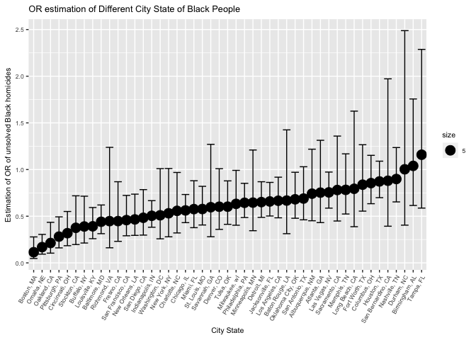
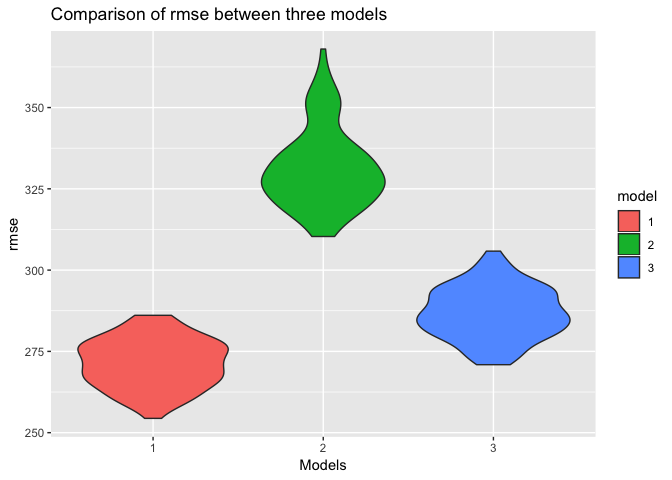

p8105\_hw6\_qw2282
================
Qinyao Wu
11/17/2018

``` r
#Import the data and tidy by combing the city and state. 
homicide_data = read_csv("data/homicide-data.csv") %>% 
    mutate(
        city_state = str_c(city, ", ", state),
        resolved = ifelse(disposition %in% c("Closed without arrest", "Open/No arrest"), 0, 1),
       resolved = as.factor(resolved)
           ) %>% 
  mutate(victim_age = as.numeric(victim_age)) %>% 
  
  #Remove the city states that we do not need. 
  
    filter(!(city_state %in% c("Dallas, TX", "Phoenix, AZ", "Kansas City, MO", "Tulsa, AL"))) %>% 
  
  #Relevel the races. 
    mutate(
        victim_race = ifelse(victim_race == "White", "white", "non-white"),
        victim_race = factor(victim_race, levels = c("white", "non-white")))
```

    ## Parsed with column specification:
    ## cols(
    ##   uid = col_character(),
    ##   reported_date = col_integer(),
    ##   victim_last = col_character(),
    ##   victim_first = col_character(),
    ##   victim_race = col_character(),
    ##   victim_age = col_character(),
    ##   victim_sex = col_character(),
    ##   city = col_character(),
    ##   state = col_character(),
    ##   lat = col_double(),
    ##   lon = col_double(),
    ##   disposition = col_character()
    ## )

    ## Warning in evalq(as.numeric(victim_age), <environment>): NAs introduced by
    ## coercion

The data was from Washington Post and it describes the data on homicides in 50 cities in US. The dataset contains 14 columns and 48507 rows. The variables in this data set are uid, reported\_date, victim\_last, victim\_first, victim\_race, victim\_age, victim\_sex, city, state, lat, lon, disposition, city\_state, resolved. The data set was tidied to do the linear regression of the number of resolved cases in all the homicides. glm function were used to fit the logistic regression and broom::tidy were used to tidy the result of the regression. Odds ratio were calculated to show the proportion.

``` r
#Filter the data for baltimore. 

baltimore_df = 
  homicide_data%>% 
   filter(city_state == "Baltimore, MD") 
#%>% 
 # select(resolved, victim_age, cat_race, victim_sex) 

#Fit baltimore data
fit_logistic = 
  baltimore_df %>% 
  glm(resolved ~ victim_age + victim_race + victim_sex, data = ., family = binomial()) 

#tidy the result to add the odds ratios.

fit_logistic %>% 
  broom::tidy() %>% 
  mutate(OR = exp(estimate), 
         
         # Add the confidence interval
         
         ci_lower = exp(estimate - qnorm(0.975) * std.error),
         ci_upper =  exp(estimate + qnorm(0.975) * std.error)) %>% 
  #Print the tatble
  knitr::kable(digits = 3)
```

| term                  |  estimate|  std.error|  statistic|  p.value|     OR|  ci\_lower|  ci\_upper|
|:----------------------|---------:|----------:|----------:|--------:|------:|----------:|----------:|
| (Intercept)           |     1.186|      0.235|      5.055|    0.000|  3.274|      2.067|      5.186|
| victim\_age           |    -0.007|      0.003|     -2.142|    0.032|  0.993|      0.987|      0.999|
| victim\_racenon-white |    -0.820|      0.175|     -4.694|    0.000|  0.441|      0.313|      0.620|
| victim\_sexMale       |    -0.888|      0.136|     -6.525|    0.000|  0.412|      0.315|      0.537|

``` r
#Apply the method to all the city states. 
OR_city_state = homicide_data %>% 
  group_by(city_state) %>% 
  nest() %>% 
  mutate(result = map(data, ~glm(resolved ~ victim_age + victim_race + victim_sex, data = .x, family = binomial()))) %>%
select(-data) %>%
   #Tidy the result with broom and add the odds ratio and the confidence interval. 
  mutate(result_tidy = map(result, broom::tidy)) %>%
  unnest(result_tidy) %>% 
  mutate(OR = exp(estimate), 
         ci_lower = exp(estimate - qnorm(0.975) * std.error),
         ci_upper =  exp(estimate + qnorm(0.975) * std.error)) %>%
  select(city_state, term, log_OR = estimate, OR, p.value, ci_lower, ci_upper) %>% 
  filter(term == "victim_racenon-white") %>% 
  mutate(city_state = forcats::fct_reorder(factor(city_state), OR)) 

#Plot the OR for all city_states. 

ggplot(OR_city_state, aes( x = city_state, y = OR)) +
  geom_point(aes(size = 5)) +
  
  #Add the error bar. 
  geom_errorbar(aes(x = city_state, ymin = ci_lower, ymax = ci_upper)) +
  theme(text = element_text(size = 8), axis.text.x = element_text(angle = 60, hjust = 1)) + 
  
  #Add the title and the name for x and y axis. 
  labs(
    title = "OR estimation of Different City State of Black People",
    x = "City State",
    y = "Estimation of OR of unsolved Black homicides"
  )
```



From this plot of homicide, we can observe that the Boston, MA has the lowest odds ratio compared to other cities. And Tampa Florida has the highest odds ratio. These odds ratios can be used to show that most of the cities actually have a bias toward non white victims.

### Problem 2

``` r
#Read the data for birthweight

data_birthweight = read.csv(file = "./data/birthweight.csv") %>% 
  janitor::clean_names() %>% 
  mutate(babysex = as.factor(babysex),
         malform = as.factor(malform),
         frace = as.factor(frace),
         mrace = as.factor(mrace))
```

The dataset of child birth weight contains 20 columns and 4342 rows. The variables in this data set are babysex, bhead, blength, bwt, delwt, fincome, frace, gaweeks, malform, menarche, mheight, momage, mrace, parity, pnumlbw, pnumsga, ppbmi, ppwt, smoken, wtgain. And we are trying to figure out the factors that might influence the child birth weight.

``` r
####Build model

###Use stepwise function
mult.fit = lm(bwt ~ ., data = data_birthweight)
step(mult.fit, direction = 'backward')
```

    ## Start:  AIC=48717.83
    ## bwt ~ babysex + bhead + blength + delwt + fincome + frace + gaweeks + 
    ##     malform + menarche + mheight + momage + mrace + parity + 
    ##     pnumlbw + pnumsga + ppbmi + ppwt + smoken + wtgain
    ## 
    ## 
    ## Step:  AIC=48717.83
    ## bwt ~ babysex + bhead + blength + delwt + fincome + frace + gaweeks + 
    ##     malform + menarche + mheight + momage + mrace + parity + 
    ##     pnumlbw + pnumsga + ppbmi + ppwt + smoken
    ## 
    ## 
    ## Step:  AIC=48717.83
    ## bwt ~ babysex + bhead + blength + delwt + fincome + frace + gaweeks + 
    ##     malform + menarche + mheight + momage + mrace + parity + 
    ##     pnumlbw + ppbmi + ppwt + smoken
    ## 
    ## 
    ## Step:  AIC=48717.83
    ## bwt ~ babysex + bhead + blength + delwt + fincome + frace + gaweeks + 
    ##     malform + menarche + mheight + momage + mrace + parity + 
    ##     ppbmi + ppwt + smoken
    ## 
    ##            Df Sum of Sq       RSS   AIC
    ## - frace     4    124365 320848704 48712
    ## - malform   1      1419 320725757 48716
    ## - ppbmi     1      6346 320730684 48716
    ## - momage    1     28661 320752999 48716
    ## - mheight   1     66886 320791224 48717
    ## - menarche  1    111679 320836018 48717
    ## - ppwt      1    131132 320855470 48718
    ## <none>                  320724338 48718
    ## - fincome   1    193454 320917792 48718
    ## - parity    1    413584 321137922 48721
    ## - mrace     3    868321 321592659 48724
    ## - babysex   1    853796 321578134 48727
    ## - gaweeks   1   4611823 325336161 48778
    ## - smoken    1   5076393 325800732 48784
    ## - delwt     1   8008891 328733230 48823
    ## - blength   1 102050296 422774634 49915
    ## - bhead     1 106535716 427260054 49961
    ## 
    ## Step:  AIC=48711.51
    ## bwt ~ babysex + bhead + blength + delwt + fincome + gaweeks + 
    ##     malform + menarche + mheight + momage + mrace + parity + 
    ##     ppbmi + ppwt + smoken
    ## 
    ##            Df Sum of Sq       RSS   AIC
    ## - malform   1      1447 320850151 48710
    ## - ppbmi     1      6975 320855679 48710
    ## - momage    1     28379 320877083 48710
    ## - mheight   1     69502 320918206 48710
    ## - menarche  1    115708 320964411 48711
    ## - ppwt      1    133961 320982665 48711
    ## <none>                  320848704 48712
    ## - fincome   1    194405 321043108 48712
    ## - parity    1    414687 321263390 48715
    ## - babysex   1    852133 321700837 48721
    ## - gaweeks   1   4625208 325473911 48772
    ## - smoken    1   5036389 325885093 48777
    ## - delwt     1   8013099 328861802 48817
    ## - mrace     3  13540415 334389119 48885
    ## - blength   1 101995688 422844392 49908
    ## - bhead     1 106662962 427511666 49956
    ## 
    ## Step:  AIC=48709.53
    ## bwt ~ babysex + bhead + blength + delwt + fincome + gaweeks + 
    ##     menarche + mheight + momage + mrace + parity + ppbmi + ppwt + 
    ##     smoken
    ## 
    ##            Df Sum of Sq       RSS   AIC
    ## - ppbmi     1      6928 320857079 48708
    ## - momage    1     28660 320878811 48708
    ## - mheight   1     69320 320919470 48708
    ## - menarche  1    116027 320966177 48709
    ## - ppwt      1    133894 320984044 48709
    ## <none>                  320850151 48710
    ## - fincome   1    193784 321043934 48710
    ## - parity    1    414482 321264633 48713
    ## - babysex   1    851279 321701430 48719
    ## - gaweeks   1   4624003 325474154 48770
    ## - smoken    1   5035195 325885346 48775
    ## - delwt     1   8029079 328879230 48815
    ## - mrace     3  13553320 334403471 48883
    ## - blength   1 102009225 422859375 49906
    ## - bhead     1 106675331 427525481 49954
    ## 
    ## Step:  AIC=48707.63
    ## bwt ~ babysex + bhead + blength + delwt + fincome + gaweeks + 
    ##     menarche + mheight + momage + mrace + parity + ppwt + smoken
    ## 
    ##            Df Sum of Sq       RSS   AIC
    ## - momage    1     29211 320886290 48706
    ## - menarche  1    117635 320974714 48707
    ## <none>                  320857079 48708
    ## - fincome   1    195199 321052278 48708
    ## - parity    1    412984 321270064 48711
    ## - babysex   1    850020 321707099 48717
    ## - mheight   1   1078673 321935752 48720
    ## - ppwt      1   2934023 323791103 48745
    ## - gaweeks   1   4621504 325478583 48768
    ## - smoken    1   5039368 325896447 48773
    ## - delwt     1   8024939 328882018 48813
    ## - mrace     3  13551444 334408523 48881
    ## - blength   1 102018559 422875638 49904
    ## - bhead     1 106821342 427678421 49953
    ## 
    ## Step:  AIC=48706.02
    ## bwt ~ babysex + bhead + blength + delwt + fincome + gaweeks + 
    ##     menarche + mheight + mrace + parity + ppwt + smoken
    ## 
    ##            Df Sum of Sq       RSS   AIC
    ## - menarche  1    100121 320986412 48705
    ## <none>                  320886290 48706
    ## - fincome   1    240800 321127090 48707
    ## - parity    1    431433 321317724 48710
    ## - babysex   1    841278 321727568 48715
    ## - mheight   1   1076739 321963029 48719
    ## - ppwt      1   2913653 323799943 48743
    ## - gaweeks   1   4676469 325562760 48767
    ## - smoken    1   5045104 325931394 48772
    ## - delwt     1   8000672 328886962 48811
    ## - mrace     3  14667730 335554021 48894
    ## - blength   1 101990556 422876847 49902
    ## - bhead     1 106864308 427750598 49952
    ## 
    ## Step:  AIC=48705.38
    ## bwt ~ babysex + bhead + blength + delwt + fincome + gaweeks + 
    ##     mheight + mrace + parity + ppwt + smoken
    ## 
    ##           Df Sum of Sq       RSS   AIC
    ## <none>                 320986412 48705
    ## - fincome  1    245637 321232048 48707
    ## - parity   1    422770 321409181 48709
    ## - babysex  1    846134 321832545 48715
    ## - mheight  1   1012240 321998651 48717
    ## - ppwt     1   2907049 323893461 48743
    ## - gaweeks  1   4662501 325648912 48766
    ## - smoken   1   5073849 326060260 48771
    ## - delwt    1   8137459 329123871 48812
    ## - mrace    3  14683609 335670021 48894
    ## - blength  1 102191779 423178191 49903
    ## - bhead    1 106779754 427766166 49950

    ## 
    ## Call:
    ## lm(formula = bwt ~ babysex + bhead + blength + delwt + fincome + 
    ##     gaweeks + mheight + mrace + parity + ppwt + smoken, data = data_birthweight)
    ## 
    ## Coefficients:
    ## (Intercept)     babysex2        bhead      blength        delwt  
    ##   -6098.822       28.558      130.777       74.947        4.107  
    ##     fincome      gaweeks      mheight       mrace2       mrace3  
    ##       0.318       11.592        6.594     -138.792      -74.887  
    ##      mrace4       parity         ppwt       smoken  
    ##    -100.678       96.305       -2.676       -4.843

``` r
#Here is my model. 
design_model = lm(bwt ~ babysex + bhead + blength + delwt + fincome + gaweeks + mheight + mrace + parity + ppwt + smoken, data = data_birthweight) 


design_model %>% 
  summary() #R squre = 0.71
```

    ## 
    ## Call:
    ## lm(formula = bwt ~ babysex + bhead + blength + delwt + fincome + 
    ##     gaweeks + mheight + mrace + parity + ppwt + smoken, data = data_birthweight)
    ## 
    ## Residuals:
    ##      Min       1Q   Median       3Q      Max 
    ## -1097.18  -185.52    -3.39   174.14  2353.44 
    ## 
    ## Coefficients:
    ##               Estimate Std. Error t value Pr(>|t|)    
    ## (Intercept) -6098.8219   137.5463 -44.340  < 2e-16 ***
    ## babysex2       28.5580     8.4549   3.378 0.000737 ***
    ## bhead         130.7770     3.4466  37.944  < 2e-16 ***
    ## blength        74.9471     2.0190  37.120  < 2e-16 ***
    ## delwt           4.1067     0.3921  10.475  < 2e-16 ***
    ## fincome         0.3180     0.1747   1.820 0.068844 .  
    ## gaweeks        11.5925     1.4621   7.929 2.79e-15 ***
    ## mheight         6.5940     1.7849   3.694 0.000223 ***
    ## mrace2       -138.7925     9.9071 -14.009  < 2e-16 ***
    ## mrace3        -74.8868    42.3146  -1.770 0.076837 .  
    ## mrace4       -100.6781    19.3247  -5.210 1.98e-07 ***
    ## parity         96.3047    40.3362   2.388 0.017004 *  
    ## ppwt           -2.6756     0.4274  -6.261 4.20e-10 ***
    ## smoken         -4.8434     0.5856  -8.271  < 2e-16 ***
    ## ---
    ## Signif. codes:  0 '***' 0.001 '**' 0.01 '*' 0.05 '.' 0.1 ' ' 1
    ## 
    ## Residual standard error: 272.3 on 4328 degrees of freedom
    ## Multiple R-squared:  0.7181, Adjusted R-squared:  0.7173 
    ## F-statistic: 848.1 on 13 and 4328 DF,  p-value: < 2.2e-16

``` r
data_birthweight %>% 
  add_residuals(model = design_model, var = "resid") %>% 
  add_predictions(model = design_model, var = "pred") %>% 
  ggplot(aes(x = pred, y = resid)) + 
  geom_point() +
  geom_smooth() + 
  #Add the title and the name for x and y axis. 
  labs(
    title = "Model Residuals v.s. Fitted Values",
    x = "Prediction values",
    y = "Residuals"
  )
```

    ## `geom_smooth()` using method = 'gam' and formula 'y ~ s(x, bs = "cs")'


#### Model proposal

I propose this model by using Stepswise Regression Selection. And by looking at these variables, these variables are meaningful in real life circumstances, especially the baby sex, babylength and gestational age in weeks. They do have a great influence on the infants' weight. In addtion to the meanings, this model also have a high adjusted r squred value, which is 0.71. This indicates that my model explains 71% of the dataset.

From the plot, we can observe that, when the prediction value is relatively small, usually smaller than 2000, the residual tend to be higher and the model don't have an accurate prediction. When the prediction value is larger than 2000, the residual becomes small and the prediction is accurate.

``` r
###Model with birth length and gaweeks
model_2 = lm(bwt ~ blength + gaweeks, data = data_birthweight) %>% 
  broom::tidy()

###Model with three way interaction
model_3 = lm(bwt ~ babysex + bhead + blength + blength * babysex * bhead, data = data_birthweight) %>% 
  broom::tidy()
```

### Comparison between models

``` r
cv_df = 
  crossv_mc(data_birthweight, 100) %>% 
  mutate(train = map(train, as_tibble),
         test = map(test, as_tibble))

#Perform the cross validation and add the rmse by using the test data. 
cv_df = 
  cv_df %>% 
  mutate(model_1    = map(train, ~lm(bwt ~ babysex + bhead + blength + delwt + fincome + gaweeks + mheight + mrace + parity + ppwt + smoken, data = data_birthweight)),
         model_2 = map(train, ~lm(bwt ~ blength + gaweeks, data = data_birthweight)),
         model_3 = map(train, ~lm(bwt ~ blength + babysex + bhead + blength * babysex * bhead, data = data_birthweight))) %>% 
  
  mutate(rmse_1   = map2_dbl(model_1, test, ~rmse(model = .x, data = .y)),
         rmse_2 = map2_dbl(model_2, test, ~rmse(model = .x, data = .y)),
         rmse_3 = map2_dbl(model_3, test, ~rmse(model = .x, data = .y)))


#Make the violin plot for three models with thr rmse. 
cv_df %>% 
  select(starts_with("rmse")) %>% 
  gather(key = model, value = rmse) %>% 
  mutate(model = str_replace(model, "rmse_", ""),
         model = fct_inorder(model)) %>% 
  ggplot(aes(x = model, y = rmse, fill = model)) + 
  geom_violin() + 
  #Add the title and the name for x and y axis. 
  labs(
    title = "Comparison of rmse between three models",
    x = "Models",
    y = "rmse"
  )
```



From the violin plot of the comparison between three models, we can conclude that the first model is the most superior one, which is the model we designed.
